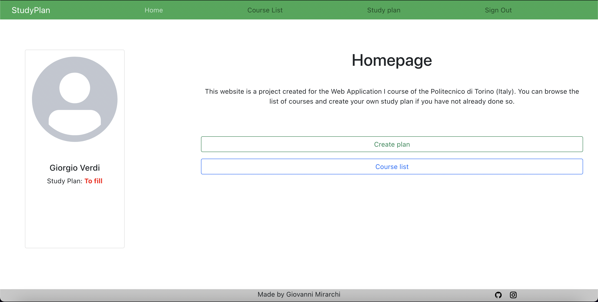
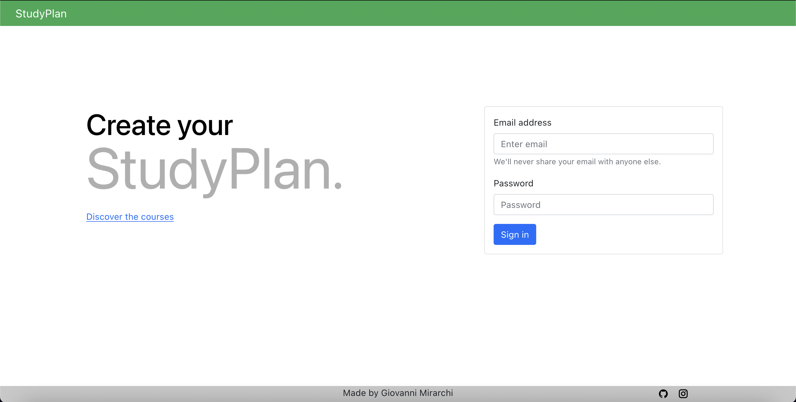
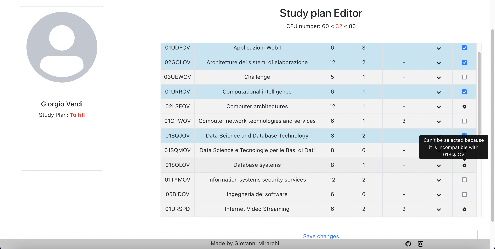

# Project for "Web Application I" class

## Author: GIOVANNI MIRARCHI

## React Client Application Routes

- Route  `/` & `/home`: Home Page / Login Page
- Route  `/courses`: Course List
- Route  `/studyplan/edit`: Study Plan creation or editing
- Route  `/studyplan/view`: Study Plan page

## API Server

- POST `/api/login` - login
    - The request body contains email and password
    - response body contains user id, username and email, also a sessionID through cookies is provided
- DELETE `/api/login` - logout
  - The server response with status 200 OK.
- GET `/api/courses` - return the list of course
- GET `/api/courses/:id` - find the course by id
- GET `/api/studyplan` - return the study plan of the logged user
- POST `/api/studyplan/submit` used to store score of signed user
    - The request take a body containing the list of courses and if it is a full-time or part-time study plan.
    - The server response with status 201 if ok, 400 else
    - This endpoint is in charge also to do the constraints' validation.
- PATCH `/api/studyplan/submit` - edit stored plan of the logged user
  - The request take a body containing the new study plan
  - The server returns 204 if ok, 400 else
- DELETE `/api/studyplan` - delete the study plan of the logged user
    - The server returns 204 if ok, 400 else


## Database Tables

- Table `courses` - contains id, name, cfu, max_students, incompatibility, prerequisites, students_number 
- Table `study_plans` - contains id, user_id, course_list
- Table `users` - contains id, email, password, full_time, study_plan_compiled, name, surname

## Main React Components

- `NavigationBar` (in `src/compontents/NavigationBar.js`): create the navbar used for site navigation
- `UserCard` (in `src/components/UserCard.js`): it is the card containing user picture and principals information
- `StudyPlanCompiler` (in `src/components/pages/StudyPlanCompiler.js`): it is the page for the study plan editing
- `StudyPlanViewer` (in `scr/components/StudyPlanViewer.js`): it is the page for the study plan visualization
- `DeletePlanModal`, `GeneralErrorModal`, `InsertedPlanModal`, and `PlanTypeChooseModal` (in `src/components/modals/`): DeletePlanModal appear when you try to delete the study plan, PlanTypeChooseModal is used to choose study plan type, GeneralErrorModal is shown when some errors occur (e.g. server down)

## Screenshots





## Users Credentials

| Email      | Password |
|------------|----------|
| u1@test.it | test     |
| u2@test.it | test     |
| u3@test.it | test     |
| u4@test.it | test     |


## To start

To start the application npm and nodejs are required.
Execute following commands:

```bash

aw1_project$ cd client
aw1_project/client$ npm install
aw1_project/client$ cd ../server
aw1_project/server$ npm install
aw1_project/server$ node index.js

-- Open another terminal --

aw1_project$ cd client
aw1_project/client$ npm start

```

The application now is started on localhost:3000
